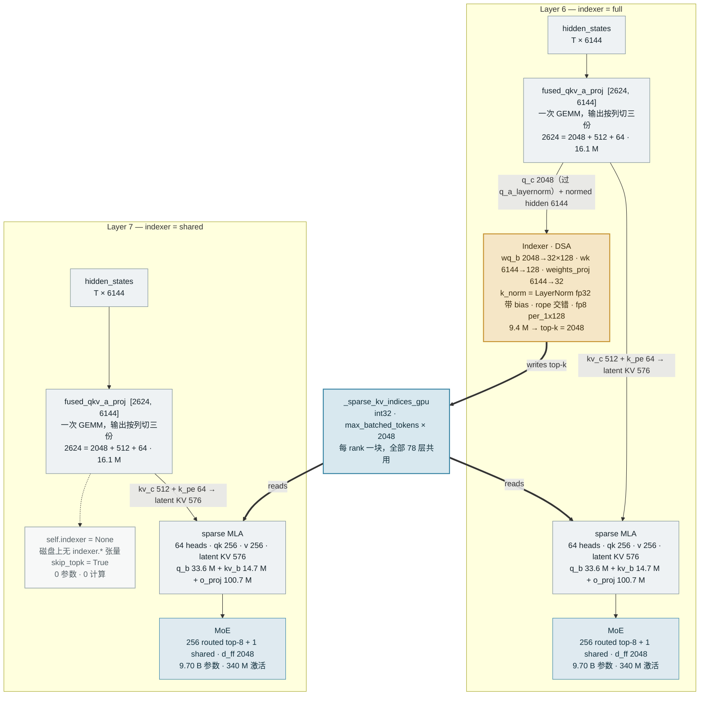

# GLM-5.2 结构解剖 · ATOM 实现

> `GlmMoeDsaForCausalLM` / `model_type = glm_moe_dsa`
> 753 B 总参数 · 41 B 单 token 激活 · 78 + 1 层 · MLA + DSA 稀疏注意力 · 1 M 上下文

GLM-5.2 在 ATOM 里**没有独立的模型文件**——它挂在 `atom/models/deepseek_v2.py` 上，
子类 `GlmMoeDsaForCausalLM` 只覆盖了一张量化排除名映射。
所有差异都由 config 数值驱动，没有一处新的算子拓扑。

真正需要读懂的是 config 里那 78 项 `indexer_types`：它一路改写了构造期的模块树、
运行期的 buffer 绑定、流水并行的跨 rank 通信，以及 MTP 的草稿循环。

---

## 目录

- [1. 规模](#1-规模)
- [2. 层调度：IndexShare](#2-层调度indexshare)
- [3. 单层数据通路](#3-单层数据通路)
- [4. config 字段 → ATOM 代码](#4-config-字段--atom-代码)
- [5. 权重实测形状](#5-权重实测形状)
- [6. IndexShare 的三处实现](#6-indexshare-的三处实现)
- [7. MTP 与投机解码](#7-mtp-与投机解码)
- [8. ATOM 侧的专属优化](#8-atom-侧的专属优化)
- [9. 注意点](#9-注意点)
- [10. 已验证的部署形态](#10-已验证的部署形态)
- [11. 读码路线](#11-读码路线)

---

## 1. 规模

| 指标 | 值 | 备注 |
|---|---:|---|
| 总参数 | **753.3 B** | 含 MTP 层；checkpoint `total_size = 755 617 140 416` B |
| 单 token 激活 | **41.25 B** | 8 routed + 1 shared 专家 |
| 主干层 / MTP 层 | **78 / 1** | MTP 是 `layers.78` |
| 拥有 indexer 的层 | **21 / 78** | 其余 57 层复用 |
| `hidden_size` | 6144 | |
| 注意力头 | 64 | `qk_head_dim = 256`，`v_head_dim = 256` |
| 专家 | 256 routed (top-8) + 1 shared | `moe_intermediate_size = 2048` |
| 上下文 | 1 048 576 | `rope_theta = 8e6`，无 YaRN |
| KV cache | 89.9 KB / token (BF16) | latent 576 × 78 层；FP8 时减半 |
| index cache | 2.7 KB / token | `(128+4) B × 21` 个 full 层 |

### 参数去了哪里

单 token 前向真正碰到的 41.25 B：

```text
MoE experts   8 routed + 1 shared × 75L  ████████████████████████████████████████   25.48 B   61.8%
Attention     MLA, 78 layers             ████████████████████                       12.87 B   31.2%
Embed + LM head                          ███                                         1.90 B    4.6%
Dense MLP     layer 0-2                  █                                           0.68 B    1.6%
Indexer       21 full layers             █                                           0.20 B    0.5%
MoE gate      75 layers                  █                                           0.12 B    0.3%
```

而 753.3 B 的总量里 **96.2 % 是 MoE 路由专家**（75 层 × 256 专家 = 724.8 B），
剩下的注意力 12.87 B、MTP 块 9.95 B、embed + lm_head 1.90 B、共享专家 2.83 B、
稠密 MLP 0.68 B、indexer 0.20 B。

---

## 2. 层调度：IndexShare

这是 GLM-5.2 相对 GLM-5 / 5.1 **唯一的结构性改动**。
把三代 config 拉出来对比，骨架完全一致（78 层 / 6144 / 64 头 / 256 专家 / `v_head_dim=256`），
5.2 只多了三个字段：`indexer_types`、`index_topk_freq=4`、`index_share_for_mtp_iteration`，
外加 `rope_theta` 1e6 → 8e6、上下文 202 752 → 1 048 576。

`indexer_types` 把每层标成两类：

- **`full`** — 本层跑 indexer，从全部 KV 里选出 2048 个下标，写入共享 buffer
- **`shared`** — **磁盘上就没有 indexer 权重**，直接复用上一个 full 层选出的下标

节奏是：前 3 层连续 full，之后每 4 层一个 full。

```text
layer   0         10        20        30        40        50        60        70         78
        +    ·    +    ·    +    ·    +    ·    +    ·    +    ·    +    ·    +    ·      +
index   ███░░░█░░░█░░░█░░░█░░░█░░░█░░░█░░░█░░░█░░░█░░░█░░░█░░░█░░░█░░░█░░░█░░░█░░░█░░░    █
mlp     ▒▒▒███████████████████████████████████████████████████████████████████████████    █

index   █ full  = 本层计算 top-k(2048) 并写入 _sparse_kv_indices_gpu   （21 层）
        ░ shared = 无 indexer 权重，复用上一个 full 层的结果            （57 层）
mlp     ▒ dense MLP, intermediate 12288  （层 0-2，first_k_dense_replace = 3）
        █ MoE, 256 routed top-8 + 1 shared, d_ff 2048  （层 3-77）
        右端独立的一格是 MTP 层 78：自带完整 indexer + 完整 MoE
```

**full 层落点：** `0, 1, 2, 6, 10, 14, 18, 22, 26, 30, 34, 38, 42, 46, 50, 54, 58, 62, 66, 70, 74`

### checkpoint 里的直接证据

| 层 | `self_attn.` 下的 indexer 张量 |
|---|---|
| `layers.0`（full） | `indexer.wq_b` · `indexer.wk` · `indexer.weights_proj` · `indexer.k_norm.{weight,bias}` |
| `layers.5`（shared） | **一个都没有** |
| `layers.78`（MTP） | 四个全有 |

shared 层不是"算了但丢弃"——是权重根本不存在。indexer 前向从 78 次降到 21 次（÷3.7），
index cache 也同步从 10.3 KB/token 降到 2.7 KB/token。

---

## 3. 单层数据通路

图中标注了每个模块的形状与参数量（单层）。



关键点：**稀疏性由模型级标志 `mla_modules.is_sparse` 决定，而不是"本层是否有 indexer"**。
这正是 shared 层在没有 indexer 的情况下仍然跑稀疏 MLA 的原因
（`atom/model_ops/attention_mla.py:486`）。

---

## 4. config 字段 → ATOM 代码

| config 字段 | 值 | ATOM 消费它的地方 |
|---|---|---|
| `index_topk` | 2048 | `hasattr(config,"index_topk")` 就是 `is_v32` 开关；决定 buffer 宽度 |
| `indexer_types` | 78 项 | `_should_skip_index_topk()` `:361` · `_indexer_weights_shared()` `:406`，**权威于 freq** |
| `index_topk_freq` | 4 | 仅在没有 `indexer_types` 时作为回退公式 |
| `index_skip_topk_offset` | 3 | 同上，见 [注意点](#9-注意点) |
| `index_n_heads` / `index_head_dim` | 32 / 128 | `Indexer.__init__` `:2154`；`head_dim==128` 是融合内核的准入条件 |
| `index_share_for_mtp_iteration` | true | `eagle_proposer.py:343` 切 `set_skip_topk`；也是 GLM 血统的识别标记 |
| `rope_interleave` | true | `_is_neox_rope_style(default_is_neox=False)` → 主 MLA rope 仍是交错 |
| `indexer_rope_interleave` | true | `_is_neox_rope_style(default_is_neox=True)` → 把 indexer rope 从 neox **翻成**交错 |
| `rope_parameters.rope_type` | `default` | 无 `factor` → `use_yarn=False` → `rope_scaling=None`，`scaling` 不做 mscale 修正 |
| `first_k_dense_replace` / `moe_layer_freq` | 3 / 1 | 决定层 0-2 用稠密 MLP。`mlp_layer_types` 字段代码并不读 |
| `scoring_func` / `topk_method` | sigmoid / noaux_tc | `FusedMoE` + `gate.e_score_correction_bias` |
| `n_group` / `topk_group` | 1 / 1 | 分组路由退化为全局 top-8 |
| `routed_scaling_factor` | 2.5 | `DeepseekV2MoE.__init__` |
| `tie_word_embeddings` | false | 使 `ReplicatedEmbedding` 优化成立 |
| `model_type` | `glm_moe_dsa` | 触发 `stable_topk`、`ReplicatedEmbedding`、融合 indexer 门控 |

---

## 5. 权重实测形状

下面每一行都是从 `GLM-5.2-FP8` 的 141 个分片头部直接读出的，不是从 config 推的。

| 张量 | dtype | shape | 拆解 |
|---|---|---|---|
| `model.embed_tokens.weight` | BF16 | `[154880, 6144]` | 951 M，未量化 |
| `…self_attn.q_a_proj.weight` | F8_E4M3 | `[2048, 6144]` | 与 kv_a 合并成 `fused_qkv_a_proj` |
| `…self_attn.kv_a_proj_with_mqa.weight` | F8_E4M3 | `[576, 6144]` | 512 latent + 64 rope |
| `…self_attn.q_b_proj.weight` | F8_E4M3 | `[16384, 2048]` | 64 × (192 nope + 64 rope) |
| `…self_attn.kv_b_proj.weight` | F8_E4M3 | `[28672, 512]` | 64 × (192 nope + **256 v**) |
| `…self_attn.o_proj.weight` | F8_E4M3 | `[6144, 16384]` | 100.7 M，单层最大的注意力权重 |
| `…indexer.wq_b.weight` | F8_E4M3 | `[4096, 2048]` | 32 个 index 头 × 128 |
| `…indexer.wk.weight` | F8_E4M3 | `[128, 6144]` | **只有一份 key**，32 个 index 头共享（MQA 式） |
| `…indexer.weights_proj.weight` | BF16 | `[32, 6144]` | 保持 BF16，在量化排除名单里 |
| `…indexer.k_norm.{weight,bias}` | BF16 | `[128]` | 带 bias，是 `LayerNorm(fp32, eps=1e-6)` 而非 RMSNorm |
| `…mlp.experts.N.gate_proj.weight` | F8_E4M3 | `[2048, 6144]` | × 256 专家 × 3 投影 = 9.66 B / 层 |
| `…layers.0.mlp.gate_proj.weight` | F8_E4M3 | `[12288, 6144]` | 仅层 0-2 的稠密 MLP |
| `…layers.78.eh_proj.weight` | BF16 | `[6144, 12288]` | MTP：`concat(enorm(e), hnorm(h))` → 6144 |

> **`v_head_dim = 256 > qk_nope_head_dim = 192`** —— V 比 K 的 nope 部分还宽。
> DeepSeek 系列全是 128/128，GLM-5.x 是目前唯一这么配的。
> 这直接决定了 `kv_b_proj` 的 28672 和 `o_proj` 的 16384。

---

## 6. IndexShare 的三处实现

### 构造期 —— 不建模块

```python
# atom/models/deepseek_v2.py:2612
if _indexer_weights_shared(config, prefix):
    self.indexer = None          # shared 层：一个参数都不建
else:
    self.indexer = Indexer(...)
    self.indexer.rotary_emb = self.indexer_rope_emb
```

`_indexer_weights_shared()`（`:406`）按 `indexer_types[layer_id] == "shared"` 判定。

同时 `MLAModules.is_sparse` 取自 `self.is_v32`（模型级），而**不是** `indexer is not None`——
否则 shared 层会被判成稠密注意力：

```python
# atom/model_ops/attention_mla.py:486
self.is_sparse_mla = mla_modules.is_sparse or (mla_modules.indexer is not None)
```

### 运行期 —— 统一重绑到同一块 buffer

metadata builder 分配一块 `_sparse_kv_indices_gpu`，然后扫过整个
`static_forward_context`，把每个带 `sparse_kv_indices_buffer` 属性的模块和 impl 都指向它：

```python
# atom/model_ops/attentions/aiter_mla.py:384
self._sparse_kv_indices_gpu = torch.empty(
    self.max_num_batched_tokens * self.index_topk, dtype=torch.int32, device=self.device)

# :522-533
for module in config.compilation_config.static_forward_context.values():
    for tgt in (module, getattr(module, "impl", None)):
        if tgt is None or not hasattr(tgt, "sparse_kv_indices_buffer"):
            continue
        tgt.sparse_kv_indices_buffer = self._sparse_kv_indices_gpu
        tgt.dcp_sparse_kv_indptr_buffer = self._dcp_sparse_kv_indptr_gpu
        tgt.dcp_owned_counts_buffer     = self._dcp_owned_counts_gpu
```

full 层的 indexer 写它，同层和后续 shared 层的 MLA 读它。
DCP 的两个补偿 buffer（压实后的 indptr 与 owned counts）一起绑，因为 indexer 三者同写、
attention 同读。

### 流水并行 —— 跨 rank 传 top-k

若某个 PP rank 的**首层是 shared**，它需要上一 rank 的选择结果。
`ModelRunner` 在启动时复刻一遍模型的 full/shared 分类，预先算好收发标志：

```python
# atom/model_engine/model_runner.py:2956-3010
self._pp_recv_needs_sparse = (not pp.is_first_rank) and _is_shared(inner.start_layer)
self._pp_send_needs_sparse = (not pp.is_last_rank)  and _is_shared(inner.end_layer)
```

只有需要时才发生这次通信。以 `VLLM_PP_LAYER_PARTITION=18,20,20,20` 为例，
起始层 0 / 18 / 38 / 58 —— 18、38、58 全是 shared，所以三次边界都要传。

### 不变量：第一层不能是 shared

否则它读到一块从未写入的 buffer。SGLang 插件在 setup 时显式断言
（`atom/plugin/sglang/models/glm52_dsa.py:60-70`）；
GLM-5.2 的 config 用连续三个 `full` 开头，正好满足。

---

## 7. MTP 与投机解码

层 78 是一个完整的 nextn 块：`enorm` / `hnorm` / `eh_proj[6144×12288]` / `shared_head.norm`，
加上一整套注意力、MoE，以及**自己的一套 indexer 权重**（9.95 B 参数）。

`index_share_for_mtp_iteration = true` 的语义容易误读——它说的**不是**"MTP 复用主干的 top-k"，
而是"多个草稿步之间复用第 0 步的 top-k"：

| 草稿步 | 动作 | 效果 |
|---|---|---|
| step 0 | `set_skip_topk(False)` | MTP 的 indexer 正常跑，为被草稿的位置选出 2048 个 KV |
| step 1…N | `set_skip_topk(True)` | 跳过 indexer，复用第 0 步写进 buffer 的下标 |

```python
# atom/spec_decode/eagle_proposer.py:343-357
if self._share_mtp_indices:
    self.model.model.set_skip_topk(False)   # step 0
    ...
    self.model.model.set_skip_topk(True)    # step 1+
```

ATOM 的层判定还额外挡了一道：`layer_id >= num_hidden_layers` 时**一律不 skip**
（`deepseek_v2.py:373-378`），避免 MTP 层被主干的 full/shared 表误判成 shared 而读到空 buffer。

---

## 8. ATOM 侧的专属优化

| 优化 | 内容 | 门控 |
|---|---|---|
| **融合 indexer 内核** | q-rope + fp8 量化 + k-cache 写入合成一个 kernel。准入条件：`index_head_dim == 128` 且 `qk_rope_head_dim == 64`，GLM 与 V3.2 同时满足 | `ATOM_ENABLE_GLM_FUSED_INDEXER` |
| **wk + weights_proj GEMM 合并** | `IndexerWkWeightsProjLinear` 把 `[128,6144]` 和 `[32,6144]` 拼成一次 GEMM 再 split。GLM checkpoint 用的是标准 `indexer.wk` / `indexer.weights_proj` 名字，合并加载路径直接可用 | `ATOM_ENABLE_DS_INDEXER_QK_ROPE_CACHE_FUSION` |
| **复制词表 embedding** | `ReplicatedEmbedding` 整表存每个 rank，省掉 embedding 后的 all-reduce。因为 `tie_word_embeddings=false`，embedding 与仍然分片的 `lm_head` 解耦，查表结果与"分片 + masked + all-reduce"逐位相同 | `ATOM_REPLICATE_VOCAB_EMBED` |
| **`stable_topk`** | TP > 1 且是 GLM-5.2 时启用稳定排序，保证各 rank 选出**完全相同**的 KV 下标。分数打平时不稳定排序会让各 rank 分歧 | 自动（`model_type` + `tp_size>1`） |
| **量化名映射** | GLM 的 HF 量化配置写 `indexers_proj`，ATOM 模块路径叫 `indexer.weights_proj`；不映射的话这条 BF16 投影会被 FP4/MXFP4 回退量化掉 | `GlmMoeDsaForCausalLM.quant_exclude_name_mapping` |
| **MoE 双流** | 共享专家与路由专家在独立 CUDA stream 上并行，注册成对 Dynamo 不透明的 custom op | `ATOM_DUAL_STREAM_MOE_TOKEN_THRESHOLD` |
| **`fused_qkv_a_proj`** | checkpoint 里拆开的 `q_a_proj` + `kv_a_proj_with_mqa` 合成一条 `MergedReplicatedLinear`，并强制 `needs_preshuffled_weight`（其前向调 preshuffle blockscale GEMM） | 默认 |

---

## 9. 注意点

### freq 回退公式与 config 的 offset 约定不一致

ATOM 的回退公式是：

```python
# atom/models/deepseek_v2.py:402
offset = int(getattr(config, "index_skip_topk_offset", 1))   # 默认 1
return max(layer_id - offset, 0) % index_topk_freq != 0
```

而 GLM-5.2 config 写的是 `index_skip_topk_offset = 3`。代入 ATOM 公式：
`max(l-3,0) % 4` 会把 layer 3 判成 full——与 `indexer_types` 里的 `shared` 相反，整体偏一层。

**当前无害**，因为 `_should_skip_index_topk()` 优先读 `indexer_types`，公式只是兜底。
但如果将来出现只给 `index_topk_freq` / `index_skip_topk_offset`、
不给 `indexer_types` 的 checkpoint，回退路径会选错层。
遇到这种权重时先确认 `indexer_types` 是否存在。

### 两个 rope 开关的默认值方向相反

`_is_neox_rope_style()`（`:308`）的语义是 **interleave 为真 ⇒ neox 为假**，两者互斥。
但两个调用点的默认值是反的：

| rope 实例 | 缺省默认 | GLM-5.2 config | 结果 |
|---|---|---|---|
| 主 MLA rope | `default_is_neox=False`（交错） | `rope_interleave=true` | 交错（与缺省一致） |
| indexer rope | `default_is_neox=True`（neox） | `indexer_rope_interleave=true` | **翻成交错** |

这是这段代码最容易读错的地方：同一个函数、同一个 `true`，一个是"确认默认"，一个是"推翻默认"。

### 上下文长度受 `index_topk` 约束

低于 2048 token 时 indexer 实质是 no-op（top-k 会选中全部）。
真正的稀疏收益要到长上下文才出现，短序列的 benchmark 看不出 IndexShare 的价值。

---

## 10. 已验证的部署形态

### 单机 · Agentic（`recipes/Agentic-GLM-5.2.md`）

| 项 | 值 |
|---|---|
| 硬件 | 4 × MI355X (`gfx950`) |
| checkpoint | `GLM-5.2-MXFP4` |
| 并行 | TP4 |
| KV cache | FP8 |
| 投机解码 | 原生 MTP，3 个草稿 token |
| 接受率 | 0.6633 → 每次前向 `1 + 3×0.6633 = 2.99` token |
| CPU 卸载 | LMCache 200 GiB，256-token chunk |

### PD 分离 · atomesh（`recipes/mesh/GLM-5.2.md`）

Prefill 用 PP4×TP1（链式流水），decode 用 TP4 + FULL CUDAGraph，Mooncake RDMA 传 KV。

```bash
export VLLM_PP_LAYER_PARTITION=18,20,20,20
```

默认均分（19/20/19/20）会在 rank 0 上 OOM —— 它还扛着 951 M 参数的 embedding 表，
所以要用前轻的分层。

### SGLang 插件路径

`atom/plugin/sglang/models/glm52_dsa.py` 刻意**不**安装 SGLang 自己的 MLA 前端，
而是保留 ATOM 原生 `MLAAttention`：只有这样，full 层写共享物理下标 buffer、
shared 层读同一块 buffer 的机制才能成立。

---

## 11. 读码路线

按这个顺序看，一小时能过完。

| # | 要理解的东西 | 位置 |
|---|---|---|
| 1 | 模型注册与类体 | `atom/models/deepseek_v2.py:3444` |
| 2 | full / shared 判定 | `:361` `_should_skip_index_topk` · `:406` `_indexer_weights_shared` |
| 3 | rope 交错 / neox 解析 | `:308` `_is_neox_rope_style` |
| 4 | Indexer 模块与前向 | `:2154` `class Indexer` · `:2288` `forward_impl` |
| 5 | top-k 内核（prefill / decode / DCP） | `:1536` `sparse_attn_indexer` |
| 6 | MLA 构造：rope、indexer、MLAModules | `:2404-2700` |
| 7 | 稀疏标志与 buffer 读取 | `atom/model_ops/attention_mla.py:486-500` · `:1493` |
| 8 | 共享 buffer 分配与重绑 | `atom/model_ops/attentions/aiter_mla.py:384` · `:522` |
| 9 | PP 跨 rank 传 top-k | `atom/model_engine/model_runner.py:2956` · `:3133` |
| 10 | MTP 的 skip_topk 切换 | `atom/spec_decode/eagle_proposer.py:343` · `atom/models/deepseek_mtp.py:245` |
| 11 | MoE：sigmoid + noaux_tc + 双流 | `atom/models/deepseek_v2.py:1077-1310` |

---

<sub>
依据本机代码与权重实测：ATOM 分支 <code>qwen38_accuracy_rebase</code> @ <code>7387efaf</code>；
checkpoint <code>/data/amd_int/models/GLM-5.2-FP8</code>（141 分片）与
<code>GLM-5.2-MXFP4</code>（282 分片，两者 config 除量化段外完全一致）。
参数量为按张量形状累加的计算值。
</sub>
